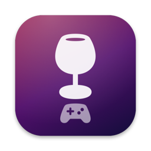
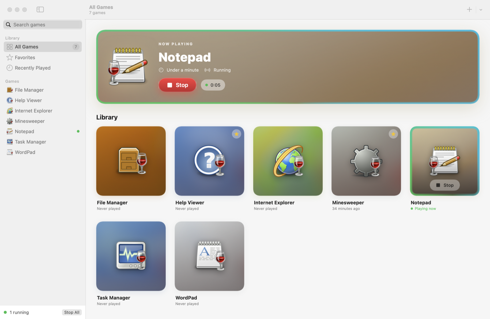
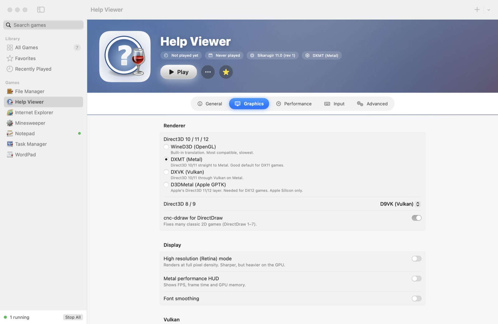
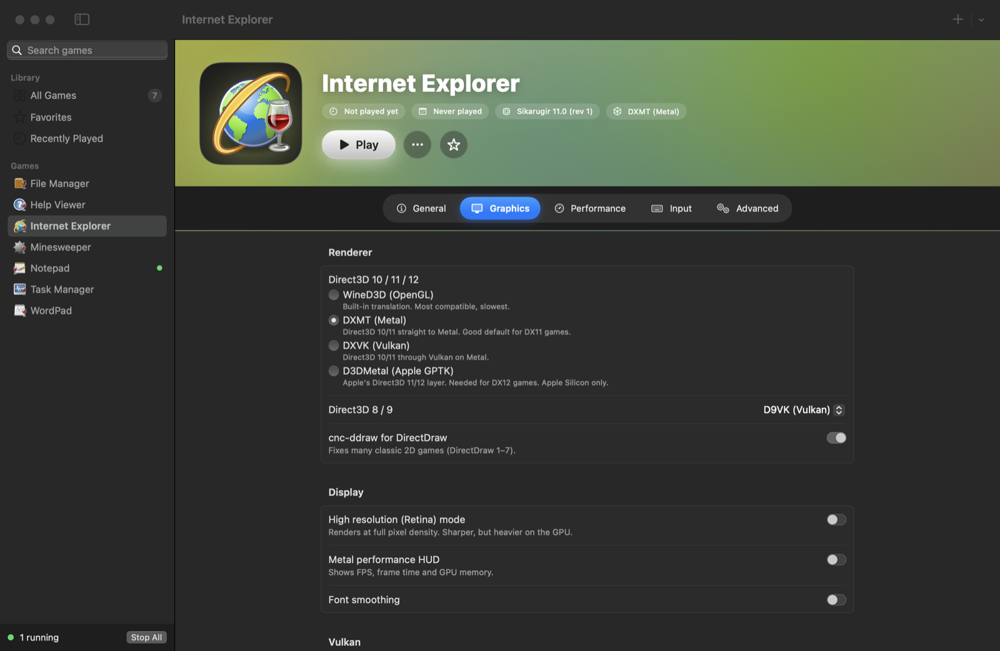
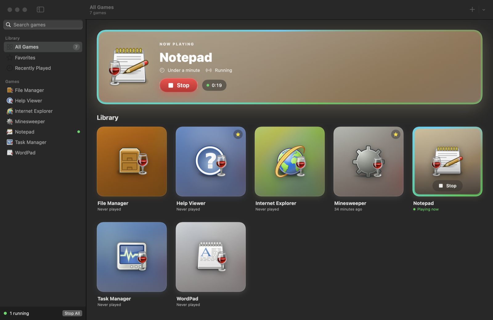
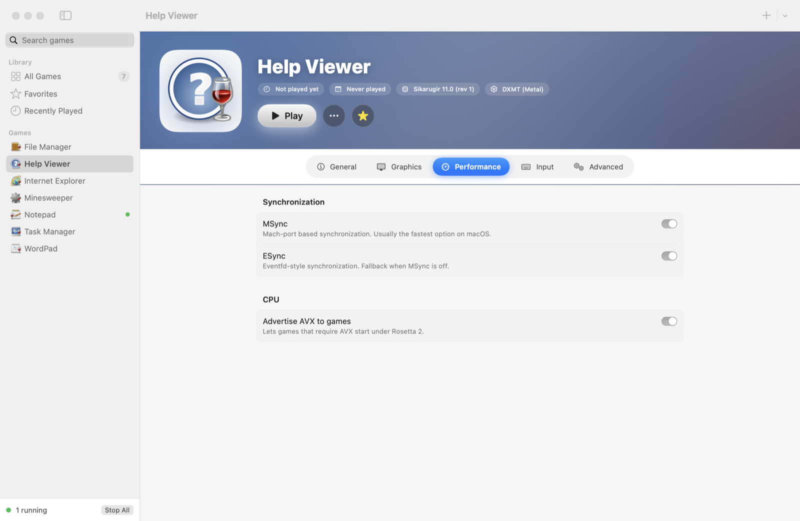
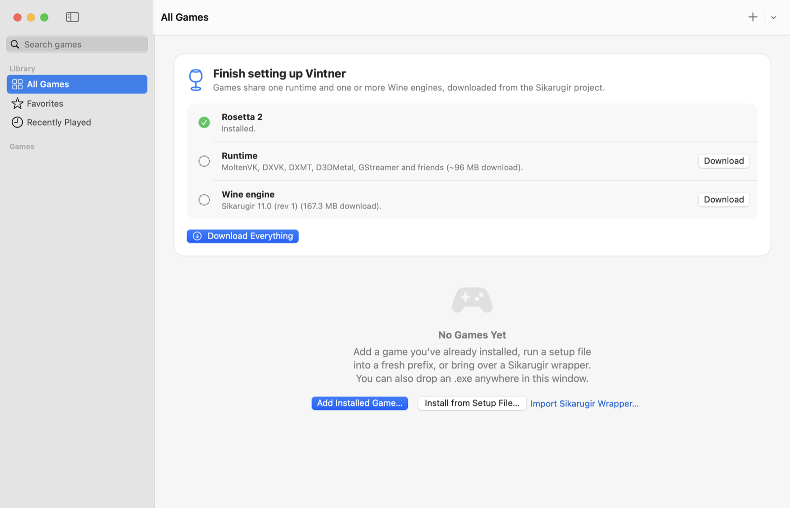
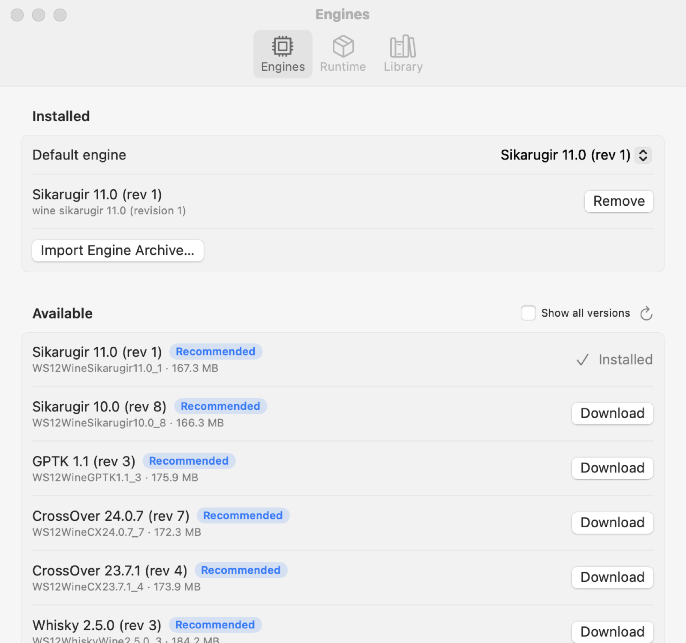
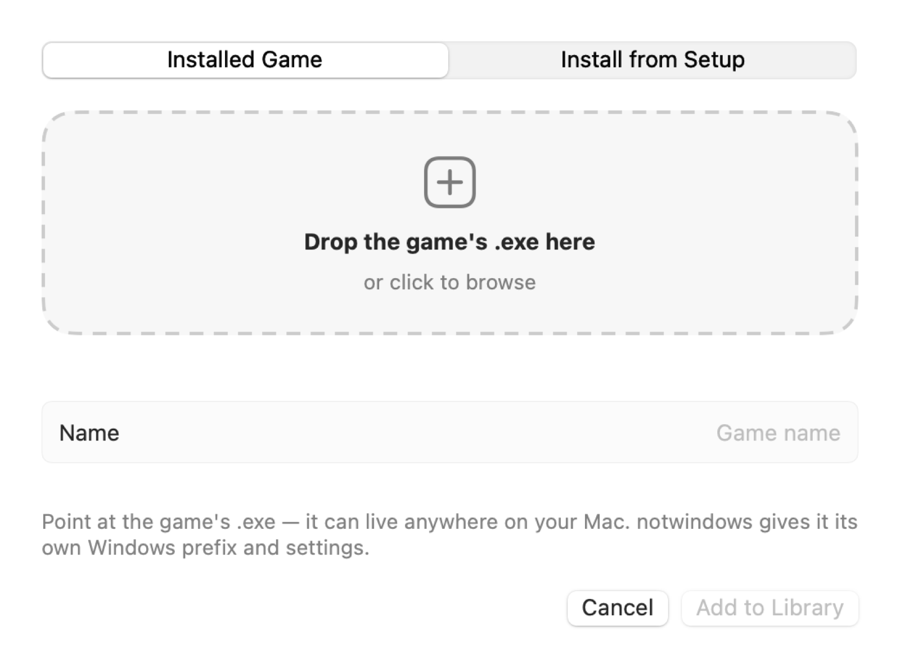

<p align="center">
  
</p>

<h1 align="center">notwindows</h1>

<p align="center">
  <b>A native macOS games launcher built on Sikarugir's Wine engines and runtime.</b><br>
  One library, with separate toggles for every setting on every game.
</p>

<p align="center">
  
  
  
  
</p>



## About

notwindows is an experimental front end built on top of the work of the [Sikarugir](https://github.com/Sikarugir-App/Sikarugir) project. Sikarugir does all the hard parts: it builds and maintains the Wine engines, integrates DXMT, DXVK, D9VK and D3DMetal, and ships the runtime that makes Windows games run well on macOS. notwindows just wouldn't exist without it.

The only thing notwindows does differently is how it presents that stack. Sikarugir is organised around wrappers; notwindows tries a games-launcher layout instead:

- **One library.** Every game appears in a grid, with artwork coloured from its own icon, playtime and when you last played.
- **Per-game settings.** Each game has its own Windows prefix and its own settings, applied when it launches.
- **Shared runtime.** Sikarugir's engines and renderer stack are downloaded once and used by every game.

It was written quickly with an AI coding agent and hasn't been battle-tested the way Sikarugir has. If you want the mature, supported tool, use [Sikarugir](https://github.com/Sikarugir-App/Sikarugir) and support its developer on [Ko-fi](https://ko-fi.com/gcenx).

## Screenshots

| | |
| --- | --- |
|  |  |
| **Per-game renderer:** WineD3D, DXMT, DXVK or D3DMetal, plus D9VK and cnc-ddraw | **Dark mode:** every game page is tinted from its icon |
|  |  |
| **Now playing:** live timer, glowing ring and one-click Stop | **Performance:** MSync, ESync, AVX under Rosetta |
|  |  |
| **First run:** Rosetta check, then the runtime and engine download in one click | **Engine manager:** browse and install Sikarugir, CrossOver, GPTK and Whisky builds |

<p align="center"></p>

<sub>The sample library uses Wine's built-in programs (Notepad, Minesweeper, …) as stand-in games.</sub>

## Features

- **Library:** icons extracted straight from each `.exe`, artwork coloured from the icon, a "Continue playing" banner, favorites, recently played, search, and playtime tracking.
- **Play / Stop:** notwindows watches the whole prefix through `wineserver`, so games started from a launcher (Steam, Battle.net, …) count as running until the last process exits.
- **Per-game settings:**
  - **Graphics:** D3D10/11/12 backend (WineD3D, DXMT, DXVK, D3DMetal), D3D8/9 backend (WineD3D, D9VK), cnc-ddraw, Vulkan driver (MoltenVK or KosmicKrisp), DXVK version, async shaders and HUD, Metal HUD, MoltenVK fast math, Retina mode, font smoothing.
  - **Performance:** MSync, ESync, advertising AVX under Rosetta.
  - **Input:** ⌘ as Ctrl, ⌥ as Alt, MFi vs HID controllers.
  - **System:** Windows version, log level, skipping Mono/Gecko, DLL overrides, extra environment variables.
- **Adding games:**
  - Point at an installed `.exe`.
  - Run a setup file into a fresh prefix, then pick the game's executable from a ranked list.
  - Import an existing Sikarugir/Wineskin wrapper. Its prefix stays where it is.
  - Drag and drop onto the window or the Dock icon.
- **Tools per game:** winecfg, regedit, Task Manager, Control Panel, Explorer, cmd, Winetricks (Sikarugir's fork), running a one-off program in the prefix, opening `C:`, and viewing the last run's log with the full environment that was used.
- **Engine manager:** lists Sikarugir's engine releases (marking the recommended ones), downloads them, imports `.tar.xz` archives, and picks up engines the Sikarugir Creator has already downloaded.
- **Polish:** cards tilt towards the pointer, running games get an animated ring, toasts appear, symbols animate, and every effect respects Reduce Motion.

## Install

Build it yourself:

```bash
git clone https://github.com/alicin/notwindows.git
```

```bash
cd notwindows && scripts/build-app.sh
```

```bash
cp -R build/notwindows.app /Applications/
```

On first launch notwindows offers to download the runtime (~96 MB) and the recommended engine (~167 MB). The engines are Intel builds, so Rosetta 2 is required:

```bash
softwareupdate --install-rosetta --agree-to-license
```

The app is ad-hoc signed. If Gatekeeper complains, right-click the app and choose **Open**.

## Development

```bash
swift test
```

```bash
scripts/build-app.sh debug
```

Set `NOTWINDOWS_HOME` to point the app at a different library folder:

```bash
open -n build/notwindows.app --env NOTWINDOWS_HOME=/tmp/nw-test
```

## How it works

| Piece | Source | Location |
| --- | --- | --- |
| Engines | `Sikarugir-App/Engines` releases (`wswine.bundle`) | `~/Library/Application Support/notwindows/Engines/<name>` |
| Runtime | `Frameworks/` and `Resources/vulkan/` from the latest `Sikarugir-App/Template` | `…/notwindows/Runtime/Template-x.y.z` |
| Games | one folder per game: `game.json`, `icon.png`, `prefix/`, `Logs/`, `Cache/` | `…/notwindows/Games/<uuid>` |

At launch, [`WineEnvironment`](Sources/notwindows/Wine/WineEnvironment.swift) turns a game's settings into the same environment Sikarugir's wrapper launcher exports. Sikarugir's Wine fork reads `WINEDLLPATH_DXMT`, `WINEDLLPATH_DXVK`, `WINEDLLPATH_D3DMETAL`, `WINEDLLPATH_D9VK` and `WINEDLLPATH_CNCD` and loads the matching renderer DLLs straight from the shared runtime, so nothing is copied into the prefix. Registry-backed settings (Retina, key mapping, font smoothing, Windows version) are written with `regedit /S`, and only when they've changed.

Two quirks of the Sikarugir engines, found by tracing the official launcher:

- Use `lib/wine/x86_64-unix/wine`. `bin/wine` can't spawn child processes outside a wrapper.
- `SikarugirAppWine11=1` must be set, or `wineboot` and every other child process exits immediately.

## Credits & licensing

notwindows is a front end. The Wine engines, the runtime (MoltenVK, KosmicKrisp, DXVK, D9VK, DXMT, cnc-ddraw, GStreamer) and winetricks it downloads all come from the [Sikarugir project](https://github.com/Sikarugir-App/Sikarugir) and are covered by their own licenses (Wine is LGPL-2.1).

D3DMetal is © Apple and covered by Apple's Game Porting Toolkit license, which doesn't allow commercial ports. See the [Sikarugir repository](https://github.com/Sikarugir-App/Sikarugir/tree/main/D3DMetal).

notwindows isn't affiliated with Sikarugir, CodeWeavers or Apple.
